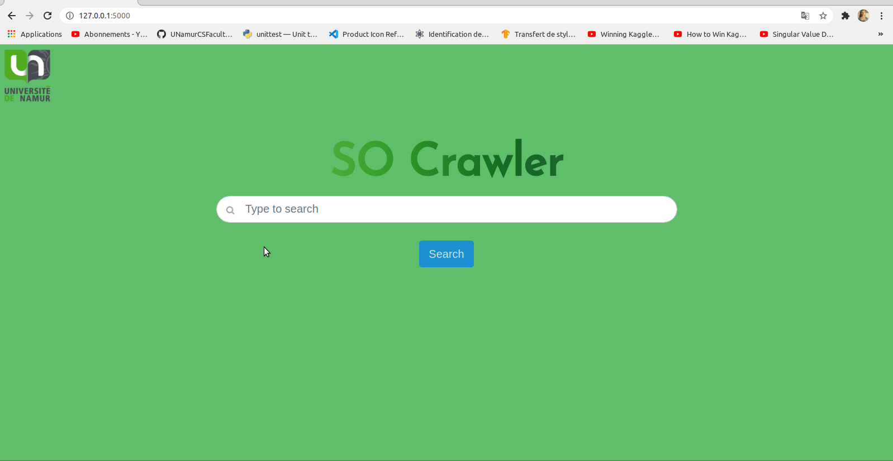

# SOcrawler



SO crawler is an application using  NLP to retrieve code snippets based on natural language query. The project is inspired by the recent advancement  paper  [https://arxiv.org/abs/2002.08155 ](https://arxiv.org/abs/2002.08155) which demonstrate that CodeBERT achieves state-of-the-art performance on both natural language code search and code documentation generation tasks. 


The model was trained on https://github.com/github/CodeSearchNet . The dataset is too heavy to be posted here but he is available at this link https://s3.amazonaws.com/code-search-net/CodeSearchNet/v2/{python,java,go,php,javascript,ruby}.zip 


As mentionned in the paper the result obtained here on python can be applied to every programming langage with appropriate fine tuning. 


# Notebook


The whole data cleaning, vectorization, training and testing process has been resumed in the notebook. 


Utilities such as data cleaning scripts,model checkpoints or model hyperparameters can be found in utils, or are generated from the notebook. Transformers class used here can be found on  https://www.tensorflow.org/tutorials/text/transformer with a nice tutorial. 

Be careful that one of the fine tuning script require using tensorflow 1.15.

The two environnements are available in the notebook folder. tensorflow1.yml for executing the finetuning and environnement.yml for the rest.

To create an environemment with all dependancies do the following


```bash
# global environnement containing torch,tensorflow,etc for the whole project
conda env create -f environment.yml -n codesearch
conda activate codesearch
#tensorflow 1 for fine tuning 
conda env create -f tensorflow1.yml -n tensorflow1
conda activate tensorflow1
```


# Architecture

SOcrawler has been made to be adaptable to a web application usage, as well as a visual code extension.Both via web server. 


The extension architecture can be used via 

```bash
yarn install

yarn run build

code .
```

And then press F5, in Extension Development Host session, run `Start React Webview` command from command palette.


The web architecture can be used via


```bash
cd Web
export FLASK_APP=app.py
flask run
```


# Testing

Deep learning being a very polyphasic approach, multiples ways of testing have been applied.

First the data processing tools were tested with asserts and function testing pre/post-conditions via the functions provided by the google team in the "TokenizationTest" class. 

```python
class TokenizationTest(tf.test.TestCase):

  def test_full_tokenizer(self):
    vocab_tokens = [
        "[UNK]", "[CLS]", "[SEP]", "want", "##want", "##ed", "wa", "un", "runn",
        "##ing", ","
    ]
    with tempfile.NamedTemporaryFile(delete=False) as vocab_writer:
      if six.PY2:
        vocab_writer.write("".join([x + "\n" for x in vocab_tokens]))
      else:
        contents = "".join([six.ensure_str(x) + "\n" for x in vocab_tokens])
        vocab_writer.write(six.ensure_binary(contents, "utf-8"))

      vocab_file = vocab_writer.name

    tokenizer = tokenization.FullTokenizer(vocab_file)
    os.unlink(vocab_file)

    tokens = tokenizer.tokenize(u"UNwant\u00E9d,running")
    self.assertAllEqual(tokens, ["un", "##want", "##ed", ",", "runn", "##ing"])

    self.assertAllEqual(
        tokenizer.convert_tokens_to_ids(tokens), [7, 4, 5, 10, 8, 9])
```

Or a simplest example where we test the very important in tokenization "lowering" property 

```python
def test_basic_tokenizer_lower(self):
    tokenizer = tokenization.BasicTokenizer(do_lower_case=True)

    self.assertAllEqual(
        tokenizer.tokenize(u" \tHeLLo!how  \n Are yoU?  "),
        ["hello", "!", "how", "are", "you", "?"])
    self.assertAllEqual(tokenizer.tokenize(u"H\u00E9llo"), ["hello"])
```


